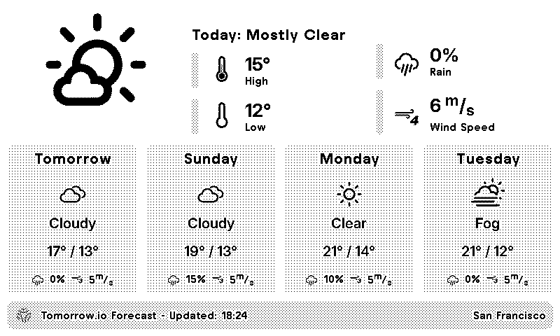

# TRMNL Daily Weather Forecast — tomorrow.io

A weather forecast plugin for TRMNL devices that displays current conditions and a 5-day forecast, powered by the [tomorrow.io](https://tomorrow.io) API.

## Features

- **5-Day Forecast**: Shows today's weather plus 4 additional forecast days
- **Detailed Weather Conditions**: Displays conditions like "Light Rain", "Heavy Snow", "Thunderstorm", etc.
- **Multiple Layouts**: Supports full, half horizontal, half vertical, and quadrant display modes
- **Beaufort Wind Scale Icons**: Wind speed visualised with Beaufort scale icons
- **Accurate Daily Data**: Uses tomorrow.io's dedicated daily timestep for true daily min/max values

## Configuration

### Required Settings

- **Tomorrow.io API Key**: Get your free API key at [app.tomorrow.io/development/keys](https://app.tomorrow.io/development/keys)
- **Latitude**: The latitude of your location
- **Longitude**: The longitude of your location

### Optional Settings

- **Temperature Unit**: Celsius (default) or Fahrenheit
- **Location Name**: Display name shown in the title bar (e.g. "Home", "London")

## Weather Data Displayed

- Weather condition with icon
- Daily high / low temperatures
- Precipitation probability (%)
- Wind speed (m/s) with Beaufort scale icon
- Humidity (%)
- UV Index
- 5-day extended forecast

## API Information

- **Data Source**: [tomorrow.io Timelines API v4](https://docs.tomorrow.io/reference/get-timelines) — `GET /v4/timelines` with `timesteps=1d`
- **Fields requested**: `temperatureMax`, `temperatureMin`, `humidity`, `windSpeed`, `precipitationProbability`, `weatherCode`, `uvIndex`
- **Update Frequency**: Every 12 hours (720 minutes)
- **Free tier**: 500 requests/day, 25 requests/hour — well within the 12-hour polling interval

## Weather Conditions Supported

| tomorrow.io Code | Condition Label      |
|------------------|----------------------|
| 1000             | Clear                |
| 1100             | Mostly Clear         |
| 1101             | Partly Cloudy        |
| 1102             | Mostly Cloudy        |
| 1001             | Cloudy               |
| 2000             | Fog                  |
| 2100             | Light Fog            |
| 4000             | Drizzle              |
| 4200             | Light Rain           |
| 4001             | Rain                 |
| 4201             | Heavy Rain           |
| 5001             | Flurries             |
| 5100             | Light Snow           |
| 5000             | Snow                 |
| 5101             | Heavy Snow           |
| 6000             | Freezing Drizzle     |
| 6200             | Light Freezing Rain  |
| 6001             | Freezing Rain        |
| 6201             | Heavy Freezing Rain  |
| 7102             | Light Ice Pellets    |
| 7000             | Ice Pellets          |
| 7101             | Heavy Ice Pellets    |
| 8000             | Thunderstorm         |

## Installation

1. Get your free API key from [tomorrow.io](https://app.tomorrow.io/development/keys)
2. Run `scripts/build.sh` to package the plugin into a ZIP file
3. Import the ZIP into your TRMNL dashboard
4. Enter your latitude, longitude, and API key in the plugin settings
5. Choose your preferred temperature unit and optionally set a location name
